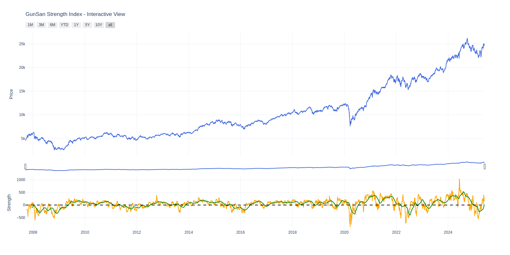
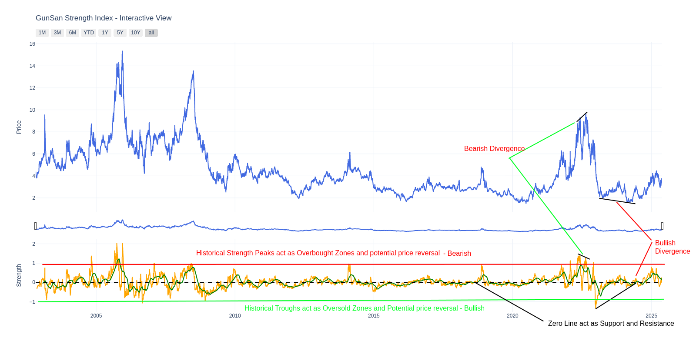
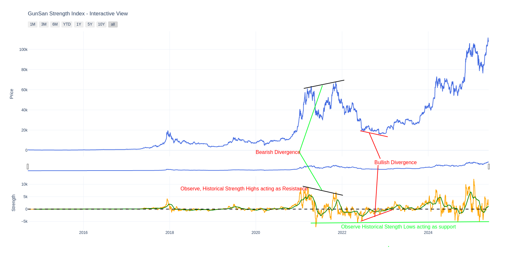

# 📈 GunSan Strength Index (GSI)

**GunSan Strength Index (GSI)** is a proprietary technical indicator developed by **Santosh Kumar Guntupalli** to quantify the strength of a financial instrument by combining trend, momentum, and volatility signals.

This package empowers analysts, traders, and quant developers to calculate and visualize strength dynamics, detect potential trend reversals, and identify strength zones such as **bullish**, **bearish**, or **flat** phases. It also helps pinpoint **overbought** and **oversold** conditions with greater precision.

By effectively blending both *leading* and *lagging* signals across trending and trading market regimes, the **GunSan Strength Index** serves as a unique hybrid indicator.

---

## 🚀 Features

- ✅ Easy-to-use API: `get_gunsan_strength(df)`
- 📊 Interactive visualization using Plotly
- 🔒 Internal proprietary logic kept private
- 📦 Clean Python package, pip installable
- 🧠 Built using vectorbt and pandas-ta

---

## 🧪 Example Usage

```python
from gunsan_strength.core import get_gunsan_strength
from gunsan_strength.plots import plot_gunsan_strength
from datetime import date
import matplotlib.pyplot as plt
import yfinance as yf
import os
import warnings
warnings.simplefilter(action='ignore')

# Define the ticker symbol,time span for Natural Gas futures
ticker_symbol = 'NG=F'
start_dt= '2019-10-28'
end_dt= date.today().strftime("%Y-%m-%d")

# Download historical data for NG futures
df = yf.download(ticker_symbol, start=start_dt, end=end_dt, multi_level_index=False)
df.reset_index(inplace=True)

# Compute GunSan Strength Index
result = get_gunsan_strength(df, signal_window=50)

# Plot the result
plot_gunsan_strength(result)
```

---

## 📦 Installation

You can install the package directly using:

```bash
pip install gunsan-strength
```

For local development:

```bash
git clone https://github.com/santosh3110/GunSan-Strength-Index.git
cd GunSan-Strength-Index
pip install -e .
```

---

## 📘 Functionality

### `get_gunsan_strength(df: pd.DataFrame, signal_window: int = 50)`

- Takes a DataFrame with OHLC data and computes:
  - `Technical_Strength`: raw strength signal
  - `Technical_Strength_Signal`: smoothed signal

### `plot_gunsan_strength(df)`

- Takes the result of `get_gunsan_strength()` and plots:
  - Close Price (zoomable)
  - GunSan Strength Indicator (interactive)

  

## 📖 User Guide

- This is both a Lagging and Leading Indicator:
  - Historical strength peaks act as overbought zone and a potential reversal - Bearish 
  - Historical strength troughs act as oversold zone and a potential reversal - Bullish
  - Above Zero line positive zone
  - Below Zero line negative zone
  - Zero line acts as Support and Resistance
  - Bullish and Bearish Divergences suggest potential reversal points
  
  

  
---

## 🔐 Disclaimer

> The internal logic used in computing the GunSan Strength Index is proprietary and **not open-sourced**. This package provides access to the results without exposing the underlying formula.

---

## 🛠 Dependencies

- `pandas`, `numpy`
- `vectorbt`, `pandas-ta`
- `plotly`, `yfinance`

See `requirements.txt` for full list.

---

## 📄 License

Licensed under the **Apache License 2.0**.

---

## 🙏 Acknowledgements

- Built with ❤️ by [@santosh3110](https://github.com/santosh3110)
- Inspired by old school technical analysis
- Dedicated to my Guru, the legendary AS Chakravarthy!
